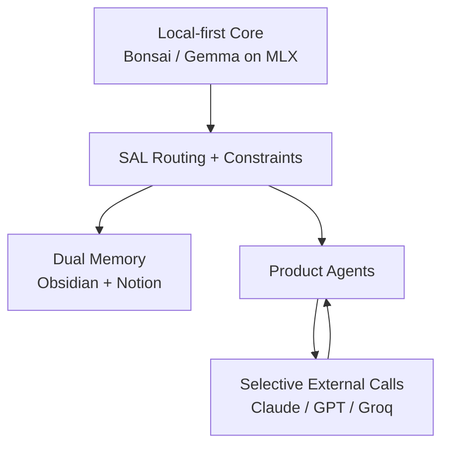

# AXON — Executive Summary

**Edge Sovereignty in the Age of Agentic AI.**

## The problem

Cloud-only agent stacks have three structural failure modes:

- **Billing walls** — autonomous ops die at per-token cost scale.
- **Latency** — every step is a round trip.
- **Privacy** — your proprietary context leaves the building on every call.

Most "AI agents" shipping today are wrappers on top of this. They collapse the day the upstream model provider ships a native feature.

## The thesis

Sovereignty is the only durable moat. That means local-first compute, local-first memory, and routing intelligence that treats the cloud as an *optional accelerator* — never a dependency.

## AXON in five lines

- **Local inference priority** — Bonsai 4B/8B on MLX, M1 Mac Mini, 5.3 GB VRAM ceiling, $0 marginal cost
- **SAL Engine** — fragment-based token-budget fitting + cross-model routing (Claude / GPT / Groq / local)
- **Dual memory** — Obsidian vault for high-density private cognition, Notion for structured shared persistence
- **Permission-first gateway** — Tool Interface Standard, Permission Guard, Risk Classifier before any tool executes
- **Tailscale edge relay** — secure mobile-to-local command without opening a port to the public internet

## Architecture at a glance

## AXON vs the alternatives

| Dimension        | Cloud-only agent stacks | Apple Intelligence        | **AXON**                              |
|------------------|-------------------------|---------------------------|---------------------------------------|
| Purpose          | SaaS wrappers            | Consumer convenience      | Industrial-grade autonomous labor     |
| Infrastructure   | Third-party APIs         | OS-proprietary             | Local-first agentic pipeline          |
| Data control     | Transit-dependent        | Ecosystem-locked           | Absolute digital sovereignty          |
| Marginal cost    | Per-token                | N/A                        | $0 on owned hardware                  |
| Interoperability | Model-locked             | Ecosystem-locked           | Cross-model routing (any provider)    |

## Who this is for

- **Investors** — edge-sovereign AI is the next infrastructure layer. AXON is the reference implementation.
- **Partners** — white-label the gateway, bring the vertical. Neuruh ships the spine.
- **Operators** — run your own agents on your own silicon. No billing wall. No data leak.

## Next step

Read the [**full white paper**](./WHITEPAPER.md). Then reach out.

— Neuruh LLC · [neuruh.com](https://neuruh.com)
